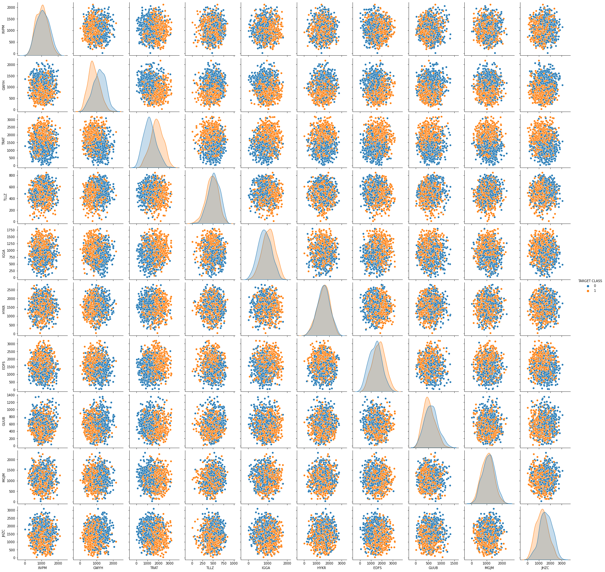
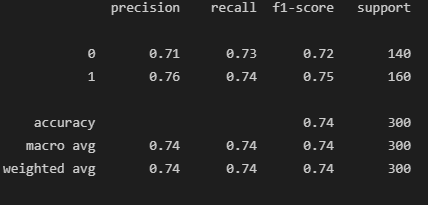
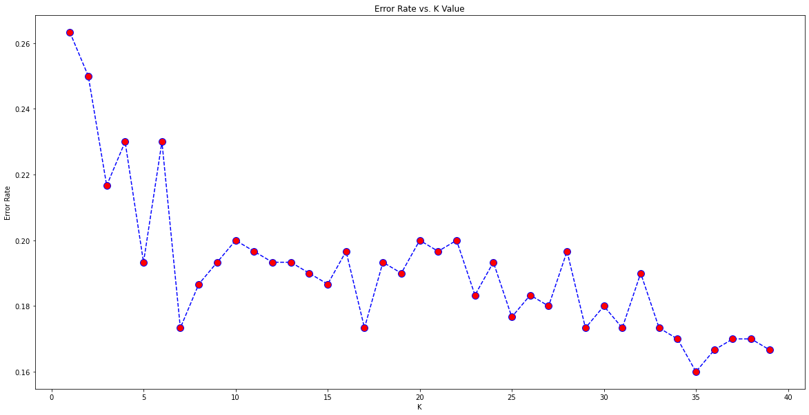
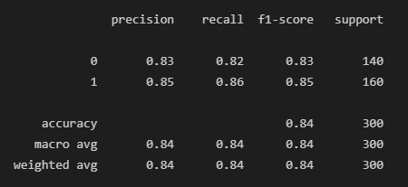

#  K-Nearest Neighbour modeling
This is a walkthrough of a  model implementation with anonymized data.

This dataset contains several variables and a TARGET CLASS. Can we create a model that, based on an observation, classifies the entry as the correct class? 

## The dataset

The KNN classifier is a method that was first developed in 1951 (that long ago!) and it is used to predict the class of a given observation by identifying the observations that are nearest to it. Therefore, the scale of our variables matter (a lot), hence I've used the scikitlearn library to standardize the variables  

With this dataset, I'll be running the following steps:
- Setting up the dataframe with Pandas
- Exploratory data analysis with seaborn
- Train test split
- K nearest neighbours
- Predictions and evaluations
- Optimising the K Value with the elbow method
- Retraining the model with new K values

## Exploratory analysis

Ultimately, we want to train a model that classifies a new entry as one of either classes (represented here by 0 and 1).

I'm using seaborn to conduct and early exploratory data analysis, by plotting the dataset with the hue set as the TARGET CLASS:

## Training and Testing Data

I'm using the [train-test-split from SciKitLearn](https://scikit-learn.org/stable/modules/generated/sklearn.model_selection.train_test_split.html) method to create 2 subsets:
- X array: Contains the features to train on
- y array: Contains the target variable (Clicked on Ad)

The model will be trained with the X array, which we'll compare to the y array to evaluate the model at the end.

To train the model, I've used the KNeighborsClassifier() method from the SciKitLearn library.

At first, I've ran the model with 1 neighbour, but in a later section I'll run a K optimisation.

## Predictions & Evaluations

When running the model with K=1 (only 1 neighbour), that's the error report I get:

Not great, hey.

Which leads us to using the ) to find out an optimal K value 

## The elbow method

In order to find the optimal K value, I've ran a loop function with K varying from 1 to 40, and plotted the results in a graph, as such:

Based on this plot, we can retrain the model with an improved K value.
For now, I'll go with K=35.

By doing so, our error rate becomes the following:

## Conclusion
If used with an optimised K, this is a reliable model to predict a binary classification problem.

## Libraries Used

| Name | Library |
| ------ | ------ |
| Pandas | https://pandas.pydata.org/ |
| Matplotlib | https://matplotlib.org/ |
| Seaborn | https://seaborn.pydata.org/ |
| SciKitLearn | https://scikit-learn.org/stable/ |